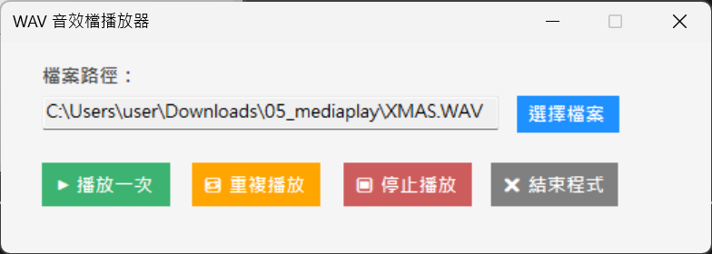

## WAV 音效檔播放器
使用 `System.Media.SoundPlayer` 播放 `.wav` 音效檔，支援瀏覽檔案、播放一次、重複播放、停止播放，以及關閉程式前確認視窗等功能。

**功能：**
- 選擇 WAV 音效檔案。
- 播放一次 (`Play`)。
- 重複播放 (`PlayLooping`)。
- 停止播放 (`Stop`)。
- 關閉程式前跳出確認訊息。

**使用技術：**
- Windows Forms
- `System.Media.SoundPlayer`
- `OpenFileDialog`
- `FormClosing` 事件處理
